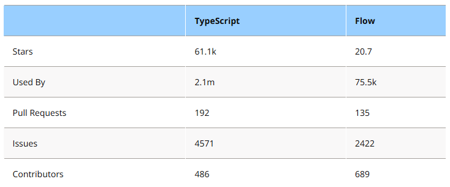
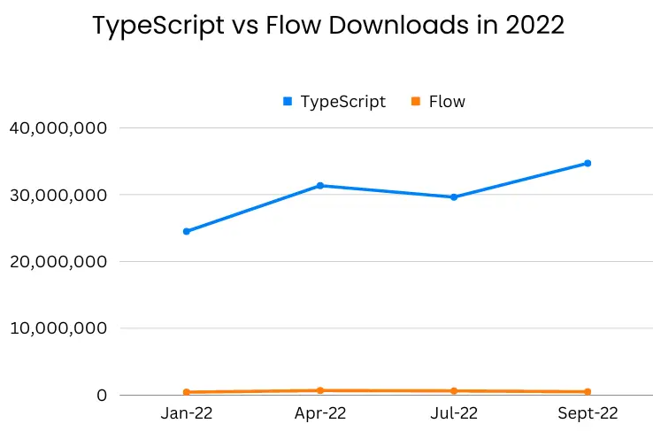

## 問題

TypeScriptとFlowについて、どちらが主流となっているかを調べなさい。
また、その理由を考えてまとめなさい。

## 解答

TypeScriptが主流となっている。

[参考資料](https://www.scalablepath.com/javascript/flow-vs-typescript)によると、Used ByでTyprScript(210万)はFlow(7.6万)を大きく上回っている。

また、2022年のダウンロード数でも、TypeScript(月間2,000万~4,000万)はFlow(月間100万以下)を大きく上回っていることが分かる。

また、TypeScriptはMicrosoftが開発・サポートしていて積極的なアップデートが行われているのに対し、FlowはMeta(Facebook)が開発・サポートしているが、近年はあまり積極的なアップデートが行われていない。実際、それぞれのGitHubリポジトリの更新頻度を見ても、TypeScriptは頻繁に更新されているのに対し、Flowはあまり更新されていないことが分かる。

このように、利用状況、コミュニティの活発さ、開発体制などの観点からも、TypeScriptが主流となっていることが分かる。

次にその理由を述べる。

まず、TypeScriptとFlowを比べたとき、それぞれ以下のメリットとデメリットがある。

1. TypeScript
   - メリット
     - 型チェックが最初から厳格で、実行時の安全性が高い
     - enum型やタプル型など多様な型、インターフェースやデコレータなどの高度な機能を提供している
   - デメリット
     - 最初からTypeScriptで書かれたコードを扱う場合、JavaScriptのみを扱ってきた開発者にとって学習コストが高い
     - 型定義のコードが多く、コードが冗長になりがち
2. Flow
   - メリット
     - 型チェックが柔軟であり、JavaScript上で必要な部分だけ型を追加できる。また、そのため学習コストが低い
     - 型定義のコードが少なく、コードがシンプルになりやすい
   - デメリット
     - 型チェックが緩いため、実行時に型エラーが発生する可能性がある
     - TypeScriptに比べて型システムが貧弱であり、高度な型定義が難しい

これらの特徴から、TypeScriptは大規模なプロジェクトやチーム開発に向いており、新規プロジェクトで最初からTypeScriptを使い、また人員もTypeScriptに習熟した開発者を採用することでメリットを享受しやすいことが分かる。一方で、FlowはJavaScriptの型注釈ライブラリとして、既存のJavaScriptコードベースに徐々に型を導入したい場合や、既存のJavaScript開発者が多いチームでの採用に向いていると考えられる。

JavaScriptはwebブラウザの軽量なスクリプト言語として使われていた時代であれば、Flowのような柔軟な型システムが適していたと思われる。しかし、近年ではサーバーサイドやモバイルアプリ開発など多様な分野でJavaScriptが利用されるようになり、コードベースも大規模化してきている。また、node.jsの登場により、JavaScriptはフロントエンドだけでなくバックエンドでも利用されるようになった。

このような背景から、型安全性を重視し、大規模開発に適したTypeScriptが相対的に主流となってきていると考えられる。また、FlowはJavaScriptからの移行という観点ではメリットがあるが、TypeScriptで最初から書かれたコードが増えてきていて、TypeScriptに習熟した開発者も増えてきているため、JavaScriptプロジェクトの移行という需要自体が減少していることも影響していると考えられる。

また、別の理由としてTypeScriptのReactとの親和性が十分に高くなったことも挙げられる。Reactは最も人気のあるフロントエンドライブラリであり、Flowは当初Reactと同じmetaによって開発されたこともあり、Reactとの親和性が高くReactと一緒に成長していくことが期待されていた。しかし、TypeScriptもReactの型定義を公式にサポートするようになり、TypeScriptでReactアプリケーションを開発することが一般的になってきている。現在ではむしろTypeScript+React(+ Next.js?)の組み合わせが主流となっている。そのため、Reactとの親和性を考えてFlowを選択する理由も薄れてきていると考えられる。

このように、JavaScriptがフロントエンド/バックエンドを問わず多様な分野で大規模に利用される時代にあって、型注釈という中途半端なシステムではなく、安全な言語としてJavaScriptを拡張する需要にマッチしたことが、TypeScriptが主流となっている理由であると考えられる。
